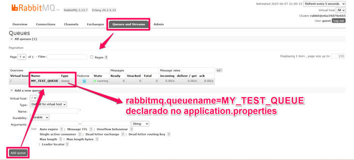

# Recebimento de Mensagem Usando a Configuração Básica do RabbitMQ


This project aims to demonstrate, in a simple way, the communication between two applications using RabbitMQ — one application acts as the message sender and the other as the receiver (Publish e Subscriber).

The following technologies were used as the foundation: Java, Spring Framework, Docker, Postman, Maven, and Lombok.

While other tools are involved, the main focus of the project is to understand the concepts and functionality of RabbitMQ.

## Table of Contents da Publisher

- [Service](#service)
- [Application Properties](#application-properties)
- [RabbitMQ com Docker](#rabbitmq-com-docker)
- [Getting to know QUEUE](#getting-to-know-queue)

## Service

```
package com.rmq.example.subscriber.service;

import org.springframework.amqp.core.Message;
import org.springframework.amqp.rabbit.annotation.RabbitListener;
import org.springframework.stereotype.Service;

@Service
public class SubscriberService {

@RabbitListener(queues = "MY_TEST_QUEUE")
public void receiveMessage(Message message){
    System.out.println(message);
}

}


```

## Application Properties

```
spring.application.name=subscriber
server.port=8082
rabbitmq.queuename=MY_TEST_QUEUE
```

## RabbitMQ com Docker

Run a RabbitMQ Management UI Docker image with the following command:

```
docker run -d --name rabbitmq -p 5672:5672 -p 15672:15672 rabbitmq:3-management
```
-d: Runs the container in detached mode (in the background).

--name rabbitmq: Assigns the name rabbitmq to your container.

-p 5672:5672: Maps the standard AMQP port (5672) from the container to your host.

-p 15672:15672: Maps the RabbitMQ management UI port (15672) from the container to your host.


## Getting to know QUEUE

👉 http://localhost:15672

👤 User: guest

🔐 Password: guest

Register the queue that is in my application.properties

Queues and Streams:

The queue in RabbitMQ is the central component for storing and delivering messages. It works like an inbox: messages are sent by producers (publishers) and consumed by consumers (subscribers).

<p align="center">
    
    </p>

After sending, we can follow the RabbitMQ overview screen to monitor the status and behavior of the queue in real time. It is extremely useful for developers and administrators to understand how messages are being handled.

<p align="center">
    
    </p>

On the Application side we can observe the sending and receiving:

Publisher:

```
2025-06-07T20:27:11.687-03:00  INFO 19224 --- [publisher] [nio-8081-exec-4] o.s.web.servlet.DispatcherServlet        : Completed initialization in 1 ms
Sending Menssage"envio de mensagem"
"envio de mensagem"
2025-06-07T20:27:11.775-03:00  INFO 19224 --- [publisher] [nio-8081-exec-4] o.s.a.r.c.CachingConnectionFactory       : Attempting to connect to: [localhost:5672]
2025-06-07T20:27:11.846-03:00  INFO 19224 --- [publisher] [nio-8081-exec-4] o.s.a.r.c.CachingConnectionFactory       : Created new connection: rabbitConnectionFactory#4a163575:0/SimpleConnection@5777cd39 [delegate=amqp://guest@127.0.0.1:5672/, localPort=65413]
```

Subscriber:
```
Body:'"envio de mensagem"' MessageProperties [headers={}, contentType=text/plain, contentEncoding=UTF-8, contentLength=0, receivedDeliveryMode=PERSISTENT, priority=0, redelivered=false, receivedExchange=, receivedRoutingKey=MY_TEST_QUEUE, deliveryTag=1, consumerTag=amq.ctag-N4Aut2RC9E9VqPoSuHBWRA, consumerQueue=MY_TEST_QUEUE])
```
